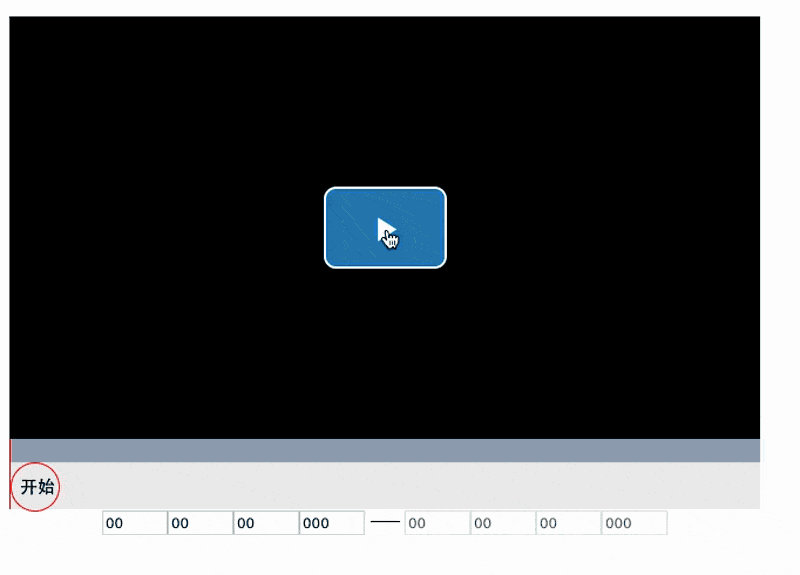

# vue-video-slider

视频辅助条 支持Vue2.X。基于[vue-video-player](https://github.com/surmon-china/vue-video-player) 和 [dragdealer](https://github.com/skidding/dragdealer)项目
## 示例



## 功能

1、对视频播放某个段落进行标注，并获得段落区间范围。

2、视频视频区域获得焦点后，可用 `space` 键操作暂停播放。如果在视频暂停的情况下 `Q` 键可操作开始结束按钮， `←` `→` 键可控制前进后退。

3、视频、视频辅助条、文本框的同步。（目前暂不支持操作视频本身进度条的同步）。

## 安装

npm i vue-video-slider --save

## 使用

1、引入"vue-video-slider"

  ```
  import VueVideoSlider from 'vue-video-slider'
  ```
  
2、在"components"接口中初始化

  ```
  components: {
    VueVideoSlider
  }
  ```
  
3、html中添加"vue-video-slider"标签

  ```
  <vue-video-slider></vue-video-slider>
  ```
  
## 属性
`:options`属性， 更多属性可参照[vue-video-player](https://github.com/surmon-china/vue-video-player)项目。
```
{
    source: {
      type: "video/mp4",   // 频类型
      src: "http://vjs.zencdn.net/v/oceans.mp4",  // 视频地址
    },
    language: 'zh-CN',  //语言
    controlBar: {
      fullscreenToggle: false,  // 全屏按钮是否可用
      volumeMenuButton: false,  // 声音按钮是否可用
      remainingTimeDisplay: false  // 视频倒计时是否显示
    },
    autoplay: false,  // 加载完成是否直接播放
    width: "640",  // 宽度
    height: "360",  // 高度
    seconds: 46  // 视频总时长
}
```
  
## 事件
| 名称        | 描述 | 示例 |
| :---------------| :---------------| :------ |
| mark    | 标注起始时间和结束时间时触发      | `@mark="youMethod"`      |
| player-state-changed | 视频事件，请参考[vue-video-player](https://github.com/surmon-china/vue-video-player) |  `@player-state-changed="youMethod"`      |
